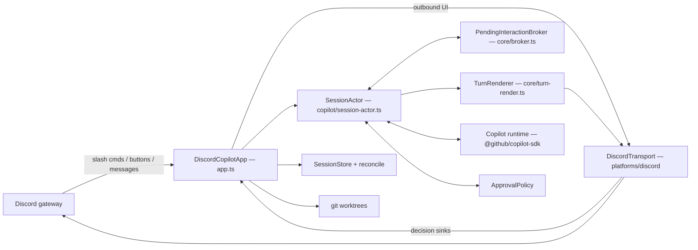

# discord-copilot-sdk — Copilot instructions

A Discord bot that drives the **local** GitHub Copilot engine through the official
`@github/copilot-sdk` (JSON-RPC). One Discord thread ⇄ one Copilot session. The agent's
messages and tool calls stream into the thread; **shell** permission requests, `ask_user`
questions and exit-plan actions get Discord button UI. Every other permission kind, and
`onElicitationRequest`, are registered but deliberately fail closed (deny / cancel + notice).

## Commands

| Task | Command |
| --- | --- |
| Build (`dist/`) | `npm run build` |
| Typecheck **src + tests** | `npm run typecheck` |
| Full test suite | `npm test` |
| One test file | `npx vitest run test/broker.test.ts` |
| One test by name | `npx vitest run test/broker.test.ts -t "settles exactly once"` |
| Watch-mode dev bot | `npm run dev` |
| Verify local Copilot wiring | `npm run build && node dist/index.js --selfcheck` |
| Live end-to-end smoke (real SDK, real login) | `npm run smoke:live` |

- **There is no lint step for TypeScript.** CI runs `npm run typecheck` + `npm test` on
  Node 20.19 and 22.12 × Ubuntu and Windows, plus a script job: `bash -n install.sh` and
  `node --check` over `scripts/setup.mjs` and `scripts/lib/*.mjs` only.
- **`npm run typecheck` is not redundant with `npm run build`.** `tsconfig.json` keeps
  `rootDir: src` so `dist/` stays clean, which leaves `test/` unchecked; `tsconfig.test.json`
  exists solely to typecheck the tests, because untyped fixtures silently drifted from the SDK's
  real shapes while the suite stayed green. Run it before claiming a change compiles.
- **`package-lock.json` is deliberately not committed** (the reason is in `.gitignore`). Use
  `npm install`; CI does `npm install --no-audit --no-fund`. A lockfile in your working tree is
  local-only — never commit it.
- `scripts/smoke-live.mjs` hits the real Copilot runtime and hardcodes a repo path; it is a
  manual acceptance tool, never part of CI.
- `.github/skills/` ships task skills for this repo (`copilot-sdk`, `codeql`, `gh-cli`,
  `git-commit`, `github-issues`, `security-review`, spec/plan authoring, …). Check there before
  reinventing a workflow.

## Architecture

- **`src/index.ts`** — entry: loads `.env`, reports pre-rename leftovers, takes the
  single-instance lock, starts `DiscordCopilotApp`. Also serves `--version` / `--selfcheck`.
- **`src/app.ts`** (the orchestrator, ~2.3k lines) — owns **inbound** Discord: slash commands,
  button interactions, thread messages, the thread⇄session map, startup reconciliation, worktree
  lifecycle, thread titling, `/queue` and steering. It imports discord.js directly; the
  `Transport` seam is for **outbound** UI, not a full abstraction of Discord. Correctness-critical
  logic is factored into exported pure helpers (`resolveButtonAck`, `decisionBindsToChannel`,
  `isOurEndedThread`, `applyYoloToggle`) so it is unit-testable without Discord.
- **`src/core/transport.ts` / `platforms/discord/discord-transport.ts`** — renders assistant
  output + prompts, and owns the decision/choice/plan sinks that feed decisions back. Renders are
  debounced ~1s, serialized per session with a write chain, and epoch-fenced per turn.
- **`src/copilot/session-actor.ts`** — owns exactly one live SDK session. Registers **all four**
  SDK callbacks from the first session (a missing handler means the SDK auto-approves exit-plan or
  leaves permissions pending forever). Holds the timeouts: `PERMISSION_TIMEOUT_MS` 5 min,
  `TURN_WATCHDOG_MS` 15 min.
- **`src/core/broker.ts`** — `PendingInteractionBroker` is where async correctness lives: a random
  nonce per request, **settle exactly once** (first of decision / timeout / abort), a generation
  fence, and a single finalizer. Timeout and abort settle with the *safe* default.
- **`src/core/approval-policy.ts`** — wider approval scopes are implemented **here, not by the
  SDK**: the local Copilot CLI reports `canOfferSessionApproval: false` for shell and does not
  honour approve-for-session, so this bot remembers approved *executables* (session scope in
  memory, repo scope persisted to `approvals.json`) and replays them to the SDK as approve-once.
  Revocation is epoch-fenced so an in-flight card can't settle against a revoked rule.
- **`src/copilot/normalize.ts` + `core/turn-render.ts`** — the SDK event shapes are pinned here
  and are easy to get wrong: `agentId` is **top-level** (absent ⇒ root agent; sub-agent events are
  dropped), deltas carry `data.deltaContent`, finals carry `data.content`, tool completion carries
  `data.success` (there is no `status`). A turn can contain several finalized messages plus one
  streaming buffer.
- **`src/core/session-store.ts` + `reconcile.ts`** — durable thread⇄session records under
  `~/.discord-copilot-sdk`. Atomic write-then-rename, **persist-first** (memory updated only after
  the disk write succeeds), corrupt ≠ absent, and `generationHighWater` persisted so a deleted
  record can't let a generation be reused. A resume error is `transient` unless it definitively
  says the session is gone — never lose conversation history on an ambiguous failure.
- **`src/core/worktree.ts`** — concurrent sessions get their own worktree on branch
  `copilot/t-<threadId>`, rooted at `~/.discord-copilot-sdk-worktrees` — a *sibling* of the state
  dir, never a child, so no agent's cwd has the trust store as an ancestor. A worktree is removed
  only when git proves it clean; when one is retained, its record is retained with it (the record
  is the only pointer to that Copilot conversation).
- **`scripts/`** — the bilingual installer/uninstaller. `setup.mjs`, `uninstall.mjs` and
  `scripts/lib/*.mjs` are plain ESM using **Node built-ins only** (they run before `npm install`),
  with logic factored into `scripts/lib/` so it can be unit-tested. `smoke-*.mjs` are manual tools
  and may import dependencies.

## Conventions

**Module system.** ESM + `NodeNext`. Every relative import carries an explicit file extension —
`.js` for TypeScript modules (including from `.ts` and from tests:
`import { X } from "../src/core/broker.js"`) and `.mjs` when a test imports an installer lib.
`strict` and `noUncheckedIndexedAccess` are on.

**Fail-closed is the house rule.** For a newly presented approval card: unsupported permission
kinds deny; timeouts and aborts resolve to deny/cancel; `ask_user` throws rather than fabricating
an answer; a summary that is too long or contains bidi/control characters is auto-denied rather
than shown partially; and the approval reaches the SDK only *after* Discord acknowledges the click
(`resolveButtonAck`) and only when the click came from the owning thread (`decisionBindsToChannel`
plus `pending.sessionKey === interaction.channelId`). Two paths deliberately skip the card and
must stay explicit when you touch this code: an executable already approved via `ApprovalPolicy`,
and per-session **YOLO** mode, which approves every permission before the kind/length/bidi checks.

**YOLO mode is never persisted.** It is actor-local and volatile so a restart or resume always
comes back OFF; enabling it only takes effect after Discord acknowledges the warning.

**Do not re-enable the SDK flags that are off.** `enableFileHooks`, `enableConfigDiscovery`,
`enableSkills` are `false` and `skipCustomInstructions` is `true` in both `session-actor.ts` and
the titler in `app.ts` — each with a comment naming the bypass it closes (a repo `.github/hooks`
file can set `resolvedByHook` and skip the Discord card entirely; instruction files load
regardless of config discovery, so *this* file is not read by the agent the bot spawns).
`createCopilotClient` strips `DISCORD_*` / `DISCOPILOT_*` from the agent's env, and
`useLoggedInUser: true` is hardcoded.

**Agent-derived output must never ping anyone.** Every send path in `discord-transport.ts` passes
`allowedMentions: { parse: [] }`; a new send path that forgets it is a real regression.

**Discord component ids** are `dp:<perm|ask|plan>:<action>:<nonce>` — namespace, action and a
random nonce only, never payloads or secrets (`platforms/discord/custom-id.ts`).

**Installer and runtime config are a contract.** `scripts/lib/validate.mjs` must accept/reject
exactly what `src/config.ts`'s zod schema does; `test/config-contract.test.ts` feeds one corpus
through both. Change a managed config key ⇒ update both sides and the corpus.

**Legacy names are reported, never honoured.** `~/.discopilot` and `DISCOPILOT_*` produce a
startup warning and nothing else — do not add fallbacks (the old prefix *is* still stripped from
the agent's environment).

**Tests use fakes; nothing reaches a real Copilot or Discord.** Fake SDK session, fake transport,
deterministic clock (`vi.useFakeTimers()` + `advanceTimersByTimeAsync`) — that is what lets CI run
with no Copilot login and no bot token. (A few suites bind a *local* HTTP server, e.g.
`download.test.ts`.) Fixtures should be **typed** — `Session`, `Transport`, `PermissionView` are
exported for exactly this reason. Fakes mirror probed real-runtime behaviour, quirks included:
`FakeSession.abort()` emits `session.idle` only when a turn was in flight. Subprocess-heavy suites
raise the limit explicitly, e.g. `describe(..., { timeout: 60_000 }, …)` in `app-reclaim`,
`setup-integration` and `worktree-git`.

**Shipped scripts are covered by tests, and encodings matter.** `test/shipped-scripts.test.ts`
asserts every user-facing `.ps1` starts with a UTF-8 BOM (Windows PowerShell 5.1 otherwise
mis-parses the Chinese strings), every `.sh` has a shebang, and every `.sh` is committed `100755`.
`.gitattributes` pins `*.sh`/`*.mjs` to LF and `install/get/run-bot/stop-bot.ps1` to CRLF.

**Bilingual where users read it.** `INSTALL.md` and `docs/DISCORD-SETUP.md` are Traditional
Chinese + English; installer strings live in `scripts/lib/i18n.mjs` and `zh` and `en` must be
updated together. `docs/PLAN.md` is Chinese-only.

**`docs/PLAN.md` is the §-numbered design record** — decisions, rejected alternatives, accepted
residual risks, and §9's map of required async-orchestration tests to the files covering them
(tests cite it by section). Treat it as rationale, not a live spec: parts lag the code (§8 still
lists queue/steering as unimplemented). Update the section you invalidate; larger designs get a
spec under `docs/superpowers/specs/`.

**Comments record the failure mode.** This codebase documents what broke without a guard and what
residual risk was knowingly accepted (see the header of `platforms/discord/render-chunks.ts`).
Preserve that when editing, and add the reasoning when you add a guard.

**Commit messages** use a conventional prefix — optionally scoped, e.g. `fix(p6):` — followed by a
sentence describing the real behaviour or defect rather than the diff, e.g.
`fix: the uninstaller trusted a PID, swallowed failures, and called it complete`.

## Security context

v1 is **lab-only**: tools run unsandboxed as the OS user that starts the bot, against
`CONTROLLED_REPO_PATH`, using the host's logged-in Copilot. Treat the controlled repo as
untrusted input to the agent, and never point a dev run at a repository you care about.
