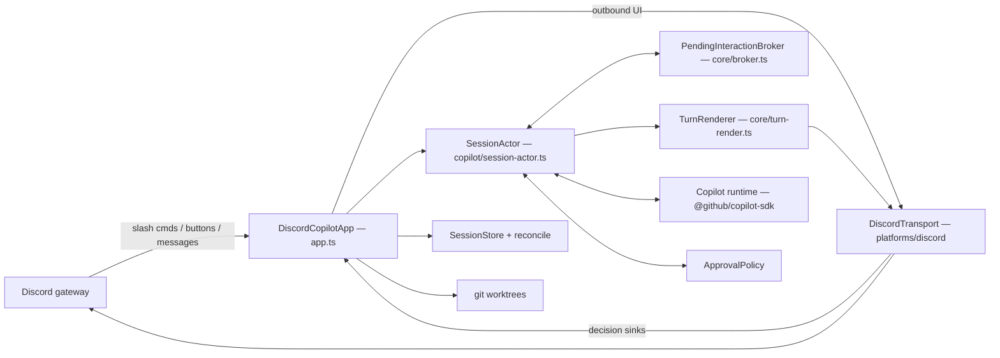

# discord-copilot-sdk — Copilot instructions

A Discord bot that drives the **local** GitHub Copilot engine through the official
`@github/copilot-sdk` (JSON-RPC). One Discord thread ⇄ one Copilot session. The agent's
messages and tool calls stream into the thread; outbound UI is limited to thread renders,
Discord decision cards, and validated file sends into the owning thread. **shell** permission
requests, `ask_user` questions and exit-plan actions get Discord button UI. Every other
permission kind, and `onElicitationRequest`, are registered but deliberately fail closed
(deny / cancel + notice).

## Commands

| Task | Command |
| --- | --- |
| Build (`dist/`) | `npm run build` |
| Typecheck **src + tests** | `npm run typecheck` |
| Full test suite | `npm test` |
| One test file | `npx vitest run test/broker.test.ts` |
| One test by name | `npx vitest run test/broker.test.ts -t "settles exactly once"` |
| Watch-mode dev bot | `npm run dev` |
| Verify local Copilot wiring | `npm run build && node dist/index.js --selfcheck` |
| Live end-to-end smoke (real SDK, real login) | `npm run smoke:live` |
| Verify skill loading (real SDK, real login) | `npm run smoke:skills` |

- **There is no lint step for TypeScript.** CI runs `npm run typecheck` + `npm test` on
  Node 20.19 and 22.12 × Ubuntu and Windows. Its script job runs `bash -n` on every shipped
  `.sh`, `node --check` on the installer/lifecycle entry `.mjs` files plus `scripts/lib/*.mjs`,
  and a PowerShell parse check on every shipped `.ps1`.
- **`npm test` serializes Vitest workers deliberately.** Several suites create real git
  repositories and worktrees; parallel workers cause nondeterministic ref-lock collisions and
  hook timeouts on CI.
- **`npm run typecheck` is not redundant with `npm run build`.** `tsconfig.json` keeps
  `rootDir: src` so `dist/` stays clean, which leaves `test/` unchecked; `tsconfig.test.json`
  exists solely to typecheck the tests, because untyped fixtures silently drifted from the SDK's
  real shapes while the suite stayed green. Run it before claiming a change compiles.
- **`package-lock.json` is deliberately not committed** (the reason is in `.gitignore`). Use
  `npm install`; CI does `npm install --no-audit --no-fund`. A lockfile in your working tree is
  local-only — never commit it.
- `scripts/smoke-live.mjs` hits the real Copilot runtime and hardcodes a repo path; it is a
  manual acceptance tool, never part of CI.
- `.github/skills/` ships task skills for this repo (`copilot-sdk`, `codeql`, `gh-cli`,
  `git-commit`, `github-issues`, `security-review`, spec/plan authoring, …). Check there before
  reinventing a workflow.

## Architecture

- **`src/index.ts`** — entry: loads `.env`, reports pre-rename leftovers, takes the
  single-instance lock, starts `DiscordCopilotApp`. Also serves `--version` / `--selfcheck`.
- **`src/app.ts`** (the orchestrator, several thousand lines — by far the largest file in the
  repo) — owns **inbound** Discord: slash commands,
  button interactions, thread messages, the thread⇄session map, startup reconciliation, worktree
  lifecycle, thread titling, `/queue` and steering. It imports discord.js directly; the
  `Transport` seam is for **outbound** UI, not a full abstraction of Discord. Correctness-critical
  logic is factored into exported pure helpers (`resolveButtonAck`, `decisionBindsToChannel`,
  `isOurEndedThread`, `applyYoloToggle`) so it is unit-testable without Discord.
- **`src/core/transport.ts` / `platforms/discord/discord-transport.ts`** — renders assistant
  output + prompts, and owns the decision/choice/plan sinks that feed decisions back. Renders are
  debounced ~1s, serialized per session with a write chain, and epoch-fenced per turn.
- **`src/copilot/session-actor.ts`** — owns exactly one live SDK session. Registers **all four**
  SDK callbacks from the first session (a missing handler means the SDK auto-approves exit-plan or
  leaves permissions pending forever). Holds the timeouts: `PERMISSION_TIMEOUT_MS` 5 min,
  `TURN_WATCHDOG_MS` 15 min.
- **`src/core/broker.ts`** — `PendingInteractionBroker` is where async correctness lives: a random
  nonce per request, **settle exactly once** (first of decision / timeout / abort), a generation
  fence, and a single finalizer. Timeout and abort settle with the *safe* default.
- **`src/core/approval-policy.ts`** — wider approval scopes are implemented **here, not by the
  SDK**: the local Copilot CLI reports `canOfferSessionApproval: false` for shell and does not
  honour approve-for-session, so this bot remembers approved *executables* (session scope in
  memory, repo scope persisted to `approvals.json`) and replays them to the SDK as approve-once.
  Revocation is epoch-fenced so an in-flight card can't settle against a revoked rule.
- **`src/copilot/normalize.ts` + `core/turn-render.ts`** — the SDK event shapes are pinned here
  and are easy to get wrong: `agentId` is **top-level** (absent ⇒ root agent; sub-agent events are
  dropped), deltas carry `data.deltaContent`, finals carry `data.content`, tool completion carries
  `data.success` (there is no `status`). A turn can contain several finalized messages plus one
  streaming buffer.
- **`src/core/session-store.ts` + `reconcile.ts`** — durable thread⇄session records under
  `~/.discord-copilot-sdk`. Atomic write-then-rename, **persist-first** (memory updated only after
  the disk write succeeds), corrupt ≠ absent, and `generationHighWater` persisted so a deleted
  record can't let a generation be reused. A resume error is `transient` unless it definitively
  says the session is gone — never lose conversation history on an ambiguous failure.
- **`src/core/channel-registry.ts` + `platforms/discord/auth.ts` +
  `platforms/discord/channel-fetch.ts`** — the Discord access model has two independent gates.
  `ChannelRegistry` is the durable set where the bot may act; Discord private-channel membership
  controls what the bot can see. Registry v1 migrates to v2 by importing
  `DISCORD_PARENT_CHANNEL_ID` once as an ordinary removable entry. Channel fetches distinguish
  gone, no-access/obfuscated, and transient failures: only no-access is retryable as
  `thread-no-access`; structural binding mismatches remain terminal. Keep `/channel` as the sole
  location-independent owner gate.
- **`src/core/worktree.ts`** — concurrent sessions get their own worktree on branch
  `copilot/t-<threadId>`, rooted at `~/.discord-copilot-sdk-worktrees` — a *sibling* of the state
  dir, never a child, so no agent's cwd has the trust store as an ancestor. A worktree is removed
  only when git proves it clean; when one is retained, its record is retained with it (the record
  is the only pointer to that Copilot conversation).
- **`scripts/`** — the bilingual installer/uninstaller. `setup.mjs`, `uninstall.mjs` and
  `scripts/lib/*.mjs` are plain ESM using **Node built-ins only** (they run before `npm install`),
  with logic factored into `scripts/lib/` so it can be unit-tested. `smoke-*.mjs` are manual tools
  and may import dependencies.

## Conventions

**Module system.** ESM + `NodeNext`. Every relative import carries an explicit file extension —
`.js` for TypeScript modules (including from `.ts` and from tests:
`import { X } from "../src/core/broker.js"`) and `.mjs` when a test imports an installer lib.
`strict` and `noUncheckedIndexedAccess` are on.

**Every MUTATING inbound operation is owned work.** The phase gate at the top of `onInteraction`
is synchronous — it only says shutdown had not begun when the event arrived — so each mutating
handler runs inside `ownership.runExclusive(inboundOperationKey(kind, id), …)` at the dispatch
seam and takes a **required** `OwnedScope`, checked with `scope.lostReason()` after its awaits.
The key is per OPERATION (interaction/message id), never per thread: a thread key would serialize
commands that run concurrently today and would be declined by an `/end` teardown claim.
`/end` and rebind are deliberately NOT wrapped — they are teardowns, already claim their thread
through `runTeardown`, and an exclusive scope around them would deadlock their own
`joinExclusive`. Read-only commands (`/sessions`, `/diff`, `/todos`, `/usage`, autocomplete) take
no scope, because there is nothing for the lock to wait for. Ownership is asked **before** an
irreversible external effect, never after one: `/file` checks it before the upload starts and
hands the transport only a session-currentness predicate, because the transport answers "no"
after Discord has accepted an attachment by *retracting* it. `startBot`'s readiness publication is
owned the same way and is retractable (`retractReady`), because the marker is an externally
visible claim that this PID is serving.

**A lost rebind asks WHY it was lost, once.** `/end` is a winner that deliberately gives the old
conversation up, so its target reservation is removed. A shutdown gave up nothing, so the
displaced primary is restored under the same CAS the pre-swap rollbacks use. The two are only
distinguishable *before* teardown runs — it clears the live map and marks every session ended —
so `applyRebindInner` latches the reason at the first observation instead of re-asking later.

**Fail-closed is the house rule.** For a newly presented approval card: unsupported permissionkinds deny; timeouts and aborts resolve to deny/cancel; `ask_user` throws rather than fabricating
an answer; a summary that is too long or contains bidi/control characters is auto-denied rather
than shown partially; and the approval reaches the SDK only *after* Discord acknowledges the click
(`resolveButtonAck`) and only when the click came from the owning thread (`decisionBindsToChannel`
plus `pending.sessionKey === interaction.channelId`). File delivery is a third outbound UI path,
but only for validated workdir files aimed at the owning thread. Outbound Discord file delivery is available only on Windows. The SDK accepts only a mutable pathname `workingDirectory`, not a retained descriptor, so Linux, macOS, and other platforms must expose no `discord_send_file`, make `/file` safely unavailable, and skip all trusted-root capture machinery while normal sessions continue. Two paths deliberately skip the
card and must stay explicit when you touch this code: an executable already approved via
`ApprovalPolicy`, and per-session **YOLO** mode, which approves every permission before the
kind/length/bidi checks.

**YOLO mode is never persisted.** It is actor-local and volatile so a restart or resume always
comes back OFF; enabling it only takes effect after Discord acknowledges the warning. The
`discord_send_file` tool is an explicit exception: YOLO never auto-approves it and instead
fast-denies with guidance to use `/file`.

**Do not re-enable broad SDK discovery or file hooks.** `enableFileHooks` and
`enableConfigDiscovery` stay `false`, and `skipCustomInstructions` stays `true` in
`session-actor.ts` and the titler in `app.ts`. A repo `.github/hooks` file can set
`resolvedByHook` and skip the Discord card entirely; broad config discovery would also load
repo MCP settings; instruction files load regardless of config discovery, so *this* file is not
read by the agent the bot spawns.

**Skills are a deliberate, narrow exception.** `SessionActor` explicitly passes only the
CLI-native repo roots (`.github/skills`, `.agents/skills`, `.claude/skills`) and the user root
(`~/.copilot/skills`) according to `ENABLE_REPO_SKILLS` / `ENABLE_USER_SKILLS`; it must **not**
set `enableConfigDiscovery:true` to do so. If no enabled root has a `SKILL.md`, it sends
`excludedTools:["skill"]`, because CLI 1.0.71 still registers the builtin skill tool even when
`enableSkills:false`, producing a guaranteed `Skill not found` failure. Repo skill descriptions
are model context: never describe this as a trust boundary. A repo skill's `allowed-tools`
frontmatter was probed against the SDK runtime and does not bypass `onPermissionRequest`, but
YOLO removes that remaining card gate; preserve the explicit YOLO warning.

`createCopilotClient` strips `DISCORD_*` / `DISCOPILOT_*` from the agent's env, and
`useLoggedInUser: true` is hardcoded. **`CopilotClient.stop()` is `Promise<Error[]>`** — it reports
a cleanup that did not work by *fulfilling* with a non-empty array, not by rejecting. Every caller
goes through `stopCopilotClient()` in `copilot/sdk.ts`; awaiting `stop()` for its side effect made
a dirty stop look like a clean one, and an armed teardown that "succeeds" is exactly what lets the
lifecycle coordinator release the single-instance lock.

**Agent-derived output must never ping anyone.** Every send path in `discord-transport.ts` passes
`allowedMentions: { parse: [] }`; a new send path that forgets it is a real regression.

**Discord component ids** are `dp:<perm|ask|plan>:<action>:<nonce>` — namespace, action and a
random nonce only, never payloads or secrets (`platforms/discord/custom-id.ts`).

**Installer and runtime config are a contract.** `scripts/lib/validate.mjs` must accept/reject
exactly what `src/config.ts`'s zod schema does; `test/config-contract.test.ts` feeds one corpus
through both. Change a managed config key ⇒ update both sides and the corpus.

**Legacy names are reported, never honoured.** `~/.discopilot` and `DISCOPILOT_*` produce a
startup warning and nothing else — do not add fallbacks (the old prefix *is* still stripped from
the agent's environment).

**Tests use fakes; nothing reaches a real Copilot or Discord.** Fake SDK session, fake transport,
deterministic clock (`vi.useFakeTimers()` + `advanceTimersByTimeAsync`) — that is what lets CI run
with no Copilot login and no bot token. (A few suites bind a *local* HTTP server, e.g.
`download.test.ts`.) Fixtures should be **typed** — `Session`, `Transport`, `PermissionView` are
exported for exactly this reason. Fakes mirror probed real-runtime behaviour, quirks included:
`FakeSession.abort()` emits `session.idle` only when a turn was in flight. Subprocess-heavy suites
raise the limit explicitly, e.g. `describe(..., { timeout: 60_000 }, …)` in `app-reclaim`,
`setup-integration` and `worktree-git`. **Slash-command tests must use
`test/support/strict-interaction.ts`**, never a hand-rolled interaction object: it models the
discord.js acknowledgement state machine (including `editReply` setting `replied`, and
`followUp` requiring a prior acknowledgement) and its acknowledgement methods are deliberately
not overridable. A permissive local fake is how a `reply()` after `deferReply()` stayed green in
the suite while aborting `/end` in production before it reclaimed anything. Assert on
`replyCalls`/`editCalls`/`followUpCalls` rather than the flags — after an edit, `replied` is
legitimately true.

**Shipped scripts are covered by tests, and encodings matter.** `test/shipped-scripts.test.ts`
asserts every user-facing `.ps1` starts with a UTF-8 BOM (Windows PowerShell 5.1 otherwise
mis-parses the Chinese strings), every `.sh` has a shebang, and every `.sh` is committed `100755`.
`.gitattributes` pins `*.sh`/`*.mjs` to LF and all six shipped user-facing `.ps1` files to CRLF.

**Bilingual where users read it.** `README.md` / `README.zh-TW.md`, `INSTALL.md` /
`INSTALL.zh-TW.md`, `docs/DISCORD-SETUP.md` / `docs/DISCORD-SETUP.zh-TW.md`,
`docs/CHANNEL-ACCESS.md` / `docs/CHANNEL-ACCESS.zh-TW.md`, and
`docs/HARNESS-EVALUATION.md` / `docs/HARNESS-EVALUATION.zh-TW.md` are separate English and zh-TW
twin files; update both twins together. Installer strings live in `scripts/lib/i18n.mjs` and `zh`
and `en` must be updated together. `docs/PLAN.md` is Chinese-only as the internal design record.

**Repository workflow and domain language.** GitHub issues in
`lettucebo/discord-copilot-sdk` are the tracker; use `gh` and follow
`docs/agents/issue-tracker.md` plus `docs/agents/triage-labels.md`. This is a single-context
codebase: use the root `CONTEXT.md` vocabulary and consult `docs/adr/` before changing a recorded
domain or architecture decision. `AGENTS.md` deliberately points human-driven agents back to this
file as the engineering source of truth.

**`docs/PLAN.md` is the §-numbered design record** — decisions, rejected alternatives, accepted
residual risks, and §9's map of required async-orchestration tests to the files covering them
(tests cite it by section). Treat it as rationale, not a live spec: parts lag the code (§8 still
lists queue/steering as unimplemented). Update the section you invalidate; larger designs get a
spec under `docs/superpowers/specs/`.

**Comments record the failure mode.** This codebase documents what broke without a guard and what
residual risk was knowingly accepted (see the header of `platforms/discord/render-chunks.ts`).
Preserve that when editing, and add the reasoning when you add a guard.

**Commit messages** use a conventional prefix — optionally scoped, e.g. `fix(p6):` — followed by a
sentence describing the real behaviour or defect rather than the diff, e.g.
`fix: the uninstaller trusted a PID, swallowed failures, and called it complete`.

## Security context

v1 is **lab-only**: tools run unsandboxed as the OS user that starts the bot, against the
repos under `REPOS_ROOT`, using the host's logged-in Copilot. Treat every bindable repo as
untrusted input to the agent, and never point a dev run at repositories you care about.

Multi-repo moved the boundary from one path to "anything under `REPOS_ROOT` that is a git
working-tree root", so two rules carry the weight the old single path used to:
`resolveReposRoot` (the root must be disjoint from the trust store in BOTH directions —
`REPOS_ROOT=~` would make `~/.discord-copilot-sdk` bindable, `REPOS_ROOT=~/.discord-copilot-sdk/x`
would put every agent's cwd under it) and `validateBinding` (git must PROVE a worktree
belongs to the repo a record claims; a path prefix cannot, and a git failure is a refusal).

**Discord channel authorization is fail-closed.** Other than `/channel`, every inbound action
requires an allow-listed user, the configured guild, and an enabled channel: a durable
`ChannelRegistry` entry, initialized once from the configured `DISCORD_PARENT_CHANNEL_ID` default
on first run and thereafter an ordinary record — not a permanent seed — indistinguishable from
one added later with `/channel enable`, and equally disable-able. `/channel` alone uses the
location-independent owner gate so an owner can bootstrap an unenabled channel; do not widen
that gate to buttons, autocomplete, or other commands. **Private-channel membership is the
primary bot-visibility whitelist**: a bot that is not a member of a channel neither receives its
events nor lists its commands there (ADR-0001, `docs/CHANNEL-ACCESS.md`). Discord Integrations
command-permission overrides are a secondary, manual server-admin layer, not bot authorization —
a visible command from an unauthorized location must still receive the normal safe refusal and
perform no work. Losing channel visibility (`50001`/Channel Obfuscation) classifies the affected
session as retryable `thread-no-access`: a single bounded periodic scan armed after startup
(`startAccessRetryLoop`, 15s backing off to 5 min) re-runs the ordinary reconcile/resume path for
those records, so it resumes automatically once access is restored — without a restart, because
restoring a permission emits no reliable gateway event for a thread the bot could not see — and it
is explicitly, manually clearable with `/end thread:<id>` after an informed owner decides to give
up on recovery (ADR-0002) — it must never be treated as a permanent block. Each retry re-fetches the
thread with `force`, because the cached channel object for a thread whose access was lost is the
obfuscated stub; regaining access emits a `CHANNEL_UPDATE` for the *channel*, which is a hint, not a
correctness source for *which bound threads* are resumable. A retry attempt that still cannot confirm
the thread (`no-access`, `transient`, unknown) writes **nothing**: rewriting the record's
`thread-no-access` reason would drop it out of both the loop's candidate filter and `/end`'s escape
hatch, parking it until a restart. `/end` claims a thread synchronously before its own first await
and the loop skips claimed threads, because `/end` removes the record several awaits later — long
enough for a resume to register a session it would then orphan; an attempt that has not settled
makes `/end` refuse rather than proceed, so no timeout value is load-bearing. `resumeRecord`
re-proves it still owns the record before it rebuilds a missing worktree, again after that rebuild,
and once more immediately before `sessions.set`; it registers a session only after `commit()` has
durably recorded the recovery, and a discarded session is entered as a coordinator obligation **before**
its disconnect is attempted, is never overwritten by a later one, and is removed only when that
exact actor's disconnect is confirmed. A thread carrying such a barrier stays a retry candidate but
the tick must clear the barrier first, so a runtime that was never proved stopped can never have a
second one resumed on top of it. Owned work asks its scope (`lostReason()`) after each await and
before **every** durable transition and external side effect, because a bounded join means an
attempt can outlive the shutdown it raced. Startup is owned too — construction, reconciliation and
each startup resume run inside scopes — so no phase of this process mutates state without something
holding the lock on its behalf.

**`src/core/lifecycle-ownership.ts` is the only thing that decides when this process lets go of its
single-instance lock** (`--selfcheck`, which never builds an app, is the one carve-out). It exists
because "may I release?" needs four unrelated-looking facts at once — is an owned attempt still
inside unrecallable REST/git/SDK work, is an explicit teardown mid-flight, is a runtime outstanding
that nobody proved stopped, has the app's resource teardown completed — and every time those were
answered in separate places the release escaped through the gap. Its external interface is
deliberately **four** operations (`arm`, `runExclusive`, `runTeardown`, `shutdown`); anything that
wants a fifth is a caller trying to reason about ownership itself, which is the mistake this
replaces. Release is a conclusion re-drawn from live state at every transition — only when the
exclusive scopes, the teardown claims and the obligations are *simultaneously* empty — never a
countdown over a snapshot. Obligations carry their payload (the actor, the retained root) so there
is no second map to drift, and first registration for a key wins, because an existing entry is an
older thing nobody proved gone.

The rules that follow from it: bootstrap creates the coordinator the instant the lock exists and
passes that same instance into `runtime.start`; a post-construction failure goes through
`app.stop()`, which closes the phase gate **synchronously** before shutdown begins, and only a
pre-construction failure calls `shutdown()` directly. Every throw site in `DiscordCopilotApp.start`
— including `resolveReposRoot` and the SDK-version check — lives inside its own `try`. The armed
teardown is `teardownResources`, never `stop()` (shutdown *calls* it, so arming `stop()` deadlocks
its own single-flight), it is bounded, and it is gated before it runs and discharged only when it
genuinely completes: wedged or failed, the lock stays held. Work that owns a thread runs inside
`runExclusive`; `/end` **and `applyRebind`** run inside `runTeardown`, because a rebind is a
teardown-and-replace of one thread — so an access retry for that thread is declined for the
duration, and a nested `/end` is a counted claim. A termination signal sets `process.exitCode`
rather than forcing an exit: a forced exit orphans a git/SDK child still running under this pid and
abandons a deferred release that was waiting for it. If nothing can discharge an obligation, the PID
lock simply stays until the process exits and the successor reclaims it as stale
(`src/core/single-instance.ts`). Any successful `captureValidatedRoot` that does not hand its
capability to a `SessionActor` must close it.
